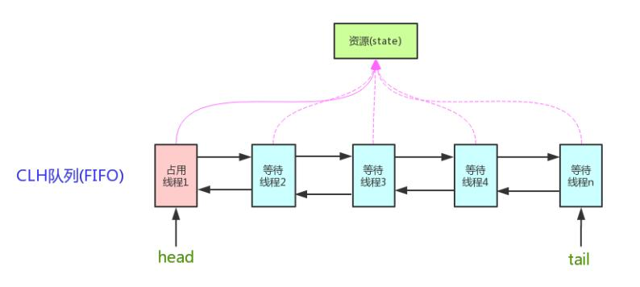

# 什么是CAS
CAS的全称为Compare And Swap，直译就是比较交换。是一条CPU的原子指令，其作用是让CPU先进行比较两个值是否相等，然后原子地更新某个
位置的值，其实现方式是基于硬件平台的汇编指令，在intel的CPU中，使用的是`cmpxchg`指令，就是说CAS是靠硬件实现的，从而在硬件层面
提升效率。

当多个线程同时使用CAS 操作一个变量时，只有一个会胜出，并成功更新，其余均会失败。失败的线程不会挂起，仅是被告知失败，并且允许再
次尝试，当然也允许实现的线程放弃操作。基于这样的原理，CAS 操作即使没有锁，也可以发现其他线程对当前线程的干扰。

与锁相比，使用CAS会使程序看起来更加复杂一些，但由于其非阻塞的，它对死锁问题天生免疫，并且，线程间的相互影响也非常小。更为重要的
是，使用无锁的方式完全没有锁竞争带来的系统开销，也没有线程间频繁调度带来的开销，因此，他要比基于锁的方式拥有更优越的性能。

简单的说，CAS 需要你额外给出一个期望值，也就是你认为这个变量现在应该是什么样子的。如果变量不是你想象的那样，哪说明它已经被别人
修改过了。你就需要重新读取，再次尝试修改就好了。

# CAS底层原理
CAS得以实现归功于硬件指令集的发展，实际上，我们可以使用同步将这两个操作变成原子的，但是这么做就没有意义了。所以我们只能靠硬件来
完成，硬件保证一个从语义上看起来需要多次操作的行为只通过一条处理器指令就能完成。这类指令常用的有： 
1. 测试并设置（Tetst-and-Set） 
2. 获取并增加（Fetch-and-Increment） 
3. 交换（Swap） 
4. 比较并交换（Compare-and-Swap） 
5. 加载链接/条件存储（Load-Linked/Store-Conditional）

# CPU实现原子操作的方法
在学习并发编程时，我们知道，多条指令不被分割操作被成为原子操作。但是，对于CPU是如何保证原子性的呢。
（来源：https://blog.csdn.net/qq_33215865/article/details/88562456）

## 对于单核CPU
对于单核cpu，所有的事件都是串行，执行完第一才会去执行第二个。所以，单核CPU实现原子操作比较简单。

在单核CPU中，每个指令都保证是原子的，即中断只会在指令之间发生。Intel x86指令集支持内存操作数的inc操作，将多条指令的操作在一条
指令内完成。因为进程的上下文切换是在总是在一条指令执行完成后，所以不会写撕裂或者读撕裂等并发问题。

## 对于多核CPU
对于多核CPU，保证单条指令并不能解决并发问题，因为多个核心可能同时运行同一个赋值语句。
* 使用总线锁
总线锁用来锁住某一个共享内存。当一个cpu要对内存进行操作时，会加上总线锁，限制其他cpu对共享内存操作。Intel x86指令集提供了指令
前缀lock用于锁定前端串行总线（FSB），保证了指令执行时不会受到其他处理器的干扰。
* 使用缓存锁
使用总线锁，会锁定cpu与内存的通信，所以开销很大。有的cpu架构提供开销更小的缓存锁。缓存锁在一个cpu进行回写时，会使用缓存一致性
机制来保护内部内存，当其他处理器回写已被锁定的缓存行的数据时会起缓存行无效。
* CAS
CAS（Compare and Swap），cas记录原来内存中的值old，和将要修改的值new。CAS会检测现在内存中的值now,如果now和old一致，则说明没
有别的cpu进行了内存修改，执行new值的更新。如果new和old值不等，则说明值已被修改，丢弃new值。

# 什么是AQS
所谓AQS，指的是AbstractQueuedSynchronizer，它提供了一种实现阻塞锁和一系列依赖FIFO等待队列的同步器的框架，ReentrantLock、
Semaphore、CountDownLatch、CyclicBarrier等并发类均是基于AQS来实现的，具体用法是通过继承AQS实现其模板方法，
然后将子类作为同步组件的内部类。

AQS基本框架如下图：

AQS 维护了一个volatile语义(支持多线程下的可见性)的共享资源变量state和一个FIFO线程等待队列(多线程竞争state被阻塞时会进入此队列)
通过 CAS 进行共享资源变量state的操作

# AQS的核心CLH锁
* CLH CLH(Craig, Landin, and Hagersten locks): 是一个自旋锁，能确保无饥饿性，提供先来先服务的公平性。
* CLH锁也是一种基于链表的可扩展、高性能、公平的自旋锁，申请线程只在本地变量上自旋，它不断轮询前驱的状态，如果发现前驱释放了锁
就结束自旋。
