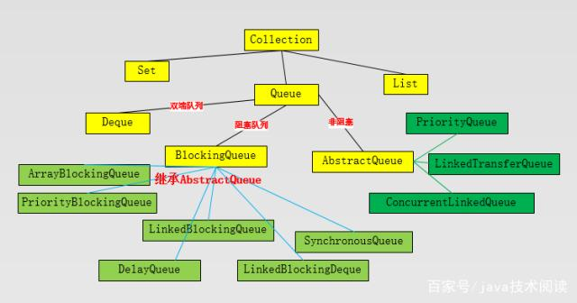

# 背景
* countDownLatch是在java1.5被引入，跟它一起被引入的工具类还有CyclicBarrier、Semaphore、concurrentHashMap和BlockingQueue
* 存在于java.util.cucurrent包下

# countDownLatch
* countDownLatch这个类使一个线程等待其他线程各自执行完毕后再执行
* 是通过一个计数器来实现的，计数器的初始值是线程的数量（通过构造函数初始化初始值）。
每当一个线程执行完毕后（调用countDown()方法），计数器的值就-1，当计数器的值为0时，表示所有线程都执行完毕，
然后在闭锁上等待的线程（await()方法之后的代码）就可以恢复工作了

```java
public class CountDownLatch {

    /** 参数count为计数值 */
    public CountDownLatch(int count) {
        //... 
    }
    
    /** 调用await()方法的线程会被挂起，它会等待直到count值为0才继续执行 */
    public void await() throws InterruptedException {
        //... 
    }

    /** 和await()类似，只不过等待一定的时间后count值还没变为0的话就会继续执行 */
    public boolean await(long timeout, TimeUnit unit) throws InterruptedException {
        //... 
    }
  
    /** 将count值减1 */
    public void countDown() {
        //... 
    };

}
```

# cyclicBarrier
* CyclicBarrier是一个同步辅助类，它允许一组线程相互等待直到所有线程都到达一个公共的屏障点
* 在程序中有固定数量的线程，这些线程有时候必须等待彼此，这种情况下，使用CyclicBarrier很有帮助
* 这个屏障之所以用循环修饰，是因为在所有的线程释放彼此之后，这个屏障是可以重新使用的

#semaphore
* Semaphore是一个计数信号量，常用于限制可以访问某些资源（物理或逻辑的）线程数目
* 初始化时指定许可证大小，每个线程访问受限资源时，需要先获取许可证，如果获取到许可证即可访问资源，如果未获取到资源，
则将线程放入队列中，等待持有许可证的线程释放许可证之后，重新获取许可证

```text
/** 构造函数-非公平 permits就是允许同时运行的线程数目 */
public Semaphore(int permits);
/** 构造函数-公平 permits就是允许同时运行的线程数目 */
public Semaphore(int permits,boolean fair);
/** 从信号量中获取一个许可，获取失败则放入队列 */
semaphore.acquire();
/** 释放一个许可(在释放许可之前，必须先获获得许可。) */
semaphore.release();
/** 尝试获取一个许可，若获取成功返回true，若获取失败返回false */
semaphore.tryAcquire();
```

# JAVA中的阻塞队列与非阻塞队列
队列是一种数据结构，它有两个基本操作：在队列尾部加入元素和从队列头部移除元素。在我们日常开发中，经常用来并发操作数据。java包中
有一些应用比较广泛的特殊队列：一种是以ConcurrentLinkedQueue为代表的非阻塞队列；另一种是以BlockingQueue接口为代表的阻塞队列。
通过这两种队列，我们保证了多线程操作数据的安全性。



java集合中的Queue继承collection接口，Dueue、LinkedList、PriorityQueue、BlockingQueue等类都实现了它。

（来源：https://baijiahao.baidu.com/s?id=1649350860832492296&wfr=spider&for=pc）

# 阻塞队列
阻塞队列 (BlockingQueue)是Java util.concurrent包下重要的数据结构，BlockingQueue提供了线程安全的队列访问方式：当阻塞队列进行
插入数据时，如果队列已满，线程将会阻塞等待直到队列非满；从阻塞队列取数据时，如果队列已空，线程将会阻塞等待直到队列非空。并发包
下很多高级同步类的实现都是基于BlockingQueue实现的。

常见的阻塞队列应用就是生产者消费者模式。生产者把数据放到队列，如果队列满了，就会阻塞此操作，直到消费者消费，如果队列中数据被消
费完，那么消费者被阻塞，直到生产者生产。

在java包`java.util.concurrent`中，提供六个实现了`BlockingQueue`接口的阻塞队列。分别是`ArrayBlockingQueue`、
`LinkedBlockingQueue`、`PriorityBlockingQueue`、`DelayQueue`、`SynchronousQueue`和`LinkedBlockingDeque`。
实质上阻塞队列是一种特殊的FIFO数据结构，它不是立即从队列中添加或删除元素，而是等到有空间或者元素可用的时候才操作。

API
```java
public interface BlockingQueue<E> extends Queue<E> {
    /**
     * 如果可能，立即将指定的元素插入队列，而不会违反容量限制；如果成功，则返回true，如果当前没有可用空间，则抛出异常
     * 使用容量受限的队列时，通常最好使用offer
     */
    boolean add(E e);
    /**
     * 如果可能，立即将指定的元素插入队列，而不会违反容量限制；如果成功，则返回true，如果当前没有可用空间，则返回false
     * 使用容量受限的队列时，此方法优于add
     */
    boolean offer(E e);
    /**
     * 将指定的元素插入队列，如果队列容量已满，则排队等待资源释放，直到获取到资源、线程中断
     */
    void put(E e) throws InterruptedException;
    /**
     * 将指定的元素插入队列，如果队列容量已满，则排队等待资源释放，直到获取到资源、线程中断或等待超时
     */
    boolean offer(E e, long timeout, TimeUnit unit)
            throws InterruptedException;
    /**
     * 检索并删除此队列的头部数据，如队列目前为空，则等待，直到队列中加入新数据为止
     */
    E take() throws InterruptedException;
    /**
     * 检索并删除此队列的头部数据，如队列目前为空，则等待，直到队列中加入新数据为止或等待超时
     */
    E poll(long timeout, TimeUnit unit)
            throws InterruptedException;
    /**
     * 返回此队列可以不阻塞的添加元素数量的最大值（在没有内存或资源限制的情况下），
     * 如果没有指定队列大小，则为Integer.MAX_VALUE
     */
    int remainingCapacity();
    /**
     * 从队列中删除指定元素的单个实例，如果队列包含指定元素，则返回true
     * 判断是否包含使用equals()方法
     */
    boolean remove(Object o);
    /**
     * 从队列中是否包含指定元素的实例，如果队列包含指定元素，则返回true
     * 判断是否包含使用equals()方法
     */
    public boolean contains(Object o);
    /**
     * 从队列中删除所有可用元素并添加它们到给定的集合。
     * 此操作可能更多比重复轮询此队列更有效。
     */
    int drainTo(Collection<? super E> c);
    /**
     * 从队列中最多移除给定数量的可用元素并添加它们到给定的集合。
     */
    int drainTo(Collection<? super E> c, int maxElements);
}
```

* `ArrayBlockingQueue`
用数组实现的有界阻塞队列，默认情况下不保证线程公平的访问队列（按照阻塞的先后顺序访问队列），队列可用的时候，阻塞的线程都可以争
夺队列的访问资格，当然也可以使用以下的构造方法创建一个公平的阻塞队列。
ArrayBlockingQueue<String> blockingQueue2 = new ArrayBlockingQueue<>(10, true)。（其实就是通过将ReentrantLock设置为true来
达到这种公平性的：即等待时间最长的线程会先操作）。用ReentrantLock condition 实现阻塞。
有界就是队列的长度有限制，例如数组队列，在构建的时候就指定了长度。无界就是可以无限地添加。

* `LinkedBlockingQueue`
基于链表实现的有界阻塞队列。此队列的默认和最大长度为Integer.MAX_VALUE。此队列按照先进先出的原则对元素进行排序。这个队列的实现
原理和ArrayBlockingQueue实现基本相同。也是采用ReentrantLock 控制并发，不同的是它使用两个独占锁来控制消费和生产。即用takeLock
和putlock,这样的好处是消费者和生产者可以并发执行，对吞吐量有提升。

* `PriorityBlockingQueue`
PriorityBlockingQueue是一个带优先级的队列，而不是先进先出队列。元素按优先级顺序被移除，该队列也没有上限
(PriorityBlockingQueue是对 PriorityQueue的再次包装，是基于堆数据结构的，而PriorityQueue是没有容量限制的，与ArrayList一样，
所以在优先阻塞 队列上put时是不会受阻的。虽然此队列逻辑上是无界的，但是由于资源被耗尽，所以试图执行添加操作可能会导致 
OutOfMemoryError)，但是如果队列为空，那么取元素的操作take就会阻塞，所以它的检索操作take是受阻的。也是用ReentrantLock控制并发

* `DelayQueue`
DelayQueue是在PriorityQueue基础上实现的，底层也是数组构造方法，是一个存放Delayed 元素的无界阻塞队列，只有在延迟期满时才能从中
提取元素。该队列的头部是延迟期满后保存时间最长的 Delayed 元素。如果延迟都还没有期满，则队列没有头部，并且poll将返回null。
当一个元素的 getDelay(TimeUnit.NANOSECONDS) 方法返回一个小于或等于零的值时，则出现期满，poll就移除这个元素了。
此队列不允许使用 null 元素。

* `SynchronousQueue`
一个没有容量的队列 ，不会存储数据，每执行一次put就要执行一次take，否则就会阻塞。未使用锁。通过cas实现，吞吐量异常高。
内部采用的就是ArrayBlockingQueue的阻塞队列，所以在功能上完全可以用ArrayBlockingQueue替换，但是SynchronousQueue是轻量级的，
SynchronousQueue不具有任何内部容量，我们可以用来在线程间安全的交换单一元素。所以功能比较单一，优势就在于轻量。

* `LinkedBlockingDeque`
LinkedBlockingDeque是双向链表实现的双向并发阻塞队列。该阻塞队列同时支持FIFO和FILO两种操作方式，即可以从队列的头和尾同时操作
(插入/删除)；并且，该阻塞队列是支持线程安全，当多线程竞争同一个资源时，某线程获取到该资源之后，其它线程需要阻塞等待。
此外，LinkedBlockingDeque还是可选容量的(防止过度膨胀)，即可以指定队列的容量。如果不指定，默认容量大小等于Integer.MAX_VALUE。

# 非阻塞队列
基于锁的算法会带来一些活跃度失败的风险。如果线程在持有锁的时候因为阻塞I/O、页面错误、或其他原因发生延迟，
很可能所有的线程都不能工作了。一个线程的失败或挂起不应该影响其他线程的失败或挂起，这样的算法称为非阻塞算法；
如果算法的每一个步骤中都有一些线程能够继续执行，那么这样的算法称为锁自由（lock-free）算法。在线程间使用CAS进行协调，
这样的算法如果能构建正确的话，它既是非阻塞的，又是锁自由的。java中提供了基于CAS非阻塞算法实现的队列，
比较有代表性的有ConcurrentLinkedQueue和LinkedTransferQueue，它们的性能一般比阻塞队列的好。

* `ConcurrentLinkedQueue`
ConcurrentLinkedQueue是一个基于链表的无界线程安全队列，它采用先进先出的规则对节点进行排序，当我们添加一个元素的时候，
它会添加到队列的尾部；当我们获取一个元素时，它会返回队列头部的元素。ConcurrentLinkedQueue的线程安全是通过其插入、
删除时采取CAS操作来保证的。由于使用CAS没有使用锁，所以获取size的时候有可能进行offer，poll或者remove操作，
导致获取的元素个数不精确，所以在并发情况下size函数不是很有用。

* `LinkedTransferQueue`
jdk7才提供这个类，这个类实现了TransferQueue接口，也是基于链表的，对于所有给定的生产者都是先入先出的。与其他阻塞队列的区别是：
其他阻塞队列，生产者生产数据，如果队列没有满，放下数据就走，消费者获取数据，看到有数据获取数据就走。
而LinkedTransferQueue生产者放数据的时候，如果此时消费者没有获取，则需阻塞等待直到有消费者过来获取数据。
有点类似SynchronousQueue，但是LinkedTransferQueue是被设计有容量的。LinkedTransferQueue 通过使用CAS来实现并发控制，
是一个无界的安全队列。其长度可以无限延伸，当然带来的问题也是显而易见的。
