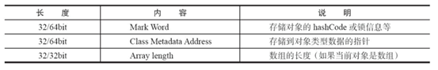
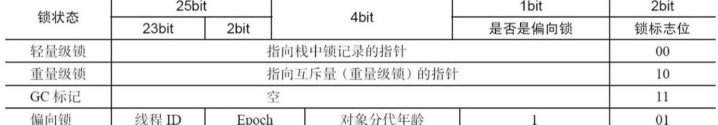
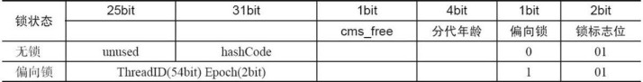

# 锁机制特性（同步通过锁机制实现）
1. `互斥性`：即在同一时间只允许一个线程持有某个对象锁，通过这种特性来实现多线程中的协调机制，这样在同一时间只有一个线程对需同步
    的代码块(复合操作)进行访问。互斥性我们也往往称为操作的原子性。
2. `可见性`：必须确保在锁被释放之前，对共享变量所做的修改，对于随后获得该锁的另一个线程是可见的（即在获得锁时应获得最新共享变量
    的值），否则另一个线程可能是在本地缓存的某个副本上继续操作从而引起不一致。

# 按照获取到的锁类型分类
1. 当前对象的对象锁：synchronized(this|object) 、synchronized修饰非静态方法
   在 Java 中，每个对象都会有一个`monitor`对象，这个对象其实就是 Java 对象的锁，通常会被称为“内置锁”或“对象锁”。类的对象可以
   有多个，所以每个对象有其独立的对象锁，互不干扰。
2. 对象Class的对象锁：synchronized(类.class)、synchronized修饰静态方法
   在 Java 中，针对每个类也有一个锁，可以称为“类锁”，类锁实际上是通过对象锁实现的，即类的Class对象锁。每个类只有一个Class对象，
   所以每个类只有一个类锁。
   
# 同步实现原理
1. 修饰对象，使用`monitorenter`和`monitorexit`指令实现，两个指令间的代码为同步代码
2. 修饰类，使用`monitorenter`和`monitorexit`指令实现，两个指令间的代码为同步代码
3. 修饰方法，使用`ACC_SYNCHRONIZED`修饰整个方法，整个方法的代码为同步代码

# monitor对象
在 Java 中，每个对象都会有一个`monitor`对象，监视器。
1. 某一线程占有这个对象的时候，先`monitor`的计数器是不是0，如果是0还没有线程占有，这个时候线程占有这个对象，并且对这个对象的
   `monitor`+1；如果不为0，表示这个线程已经被其他线程占有，这个线程等待。当线程释放占有权的时候，`monitor`-1；
2. 同一线程可以对同一对象进行多次加锁，每次加锁`monitor`+1，重入性

# 对象头
一个对象实例包含：对象头、实例变量、填充数据
对象头信息如下表：

## Mark Word
在 32 位系统下，存放 Class 指针的空间大小是 4 字节，Mark Word 空间大小也是4字节，因此头部就是 8 字节，如果是数组就需要再加 4 
字节表示数组的长度，如下表所示：

在 64 位系统及 64 位 JVM 下，开启指针压缩，那么头部存放 Class 指针的空间大小还是4字节，而 Mark Word 区域会变大，变成 8 字节，
也就是头部最少为 12 字节，如下表所示：

# 锁优化
**JDK1.6 以前为重量级锁**

**JDK1.6及之后版本针对锁的状态做了划分，以提高新能**
* 无锁状态: 没有加锁
* 偏向锁：在对象第一次被某一线程占有的时候，偏向锁置1，锁标志位置为01，写入线程号，当其他的线程访问的时候，竞争，失败，升级轻量级锁
  * 并发场景下，第一次占有它的线程获取锁次数多  
  * CAS算法 compare and swap（CAS）
  * 与无锁状态时间非常接近
  * 竞争不激烈的时候适用
* 轻量级锁：线程有交替适用，互斥性不是很强，CAS成功，锁标志位置为00，CAS失败，升级重量级锁
* 重量级锁：强互斥，锁标志位10，等待时间长
* 自旋锁：竞争失败的时候，不是马上转化级别，而是执行几次空循环（5次 10次...）
* 锁消除：JIT在编译的时候把不必要的锁去掉
