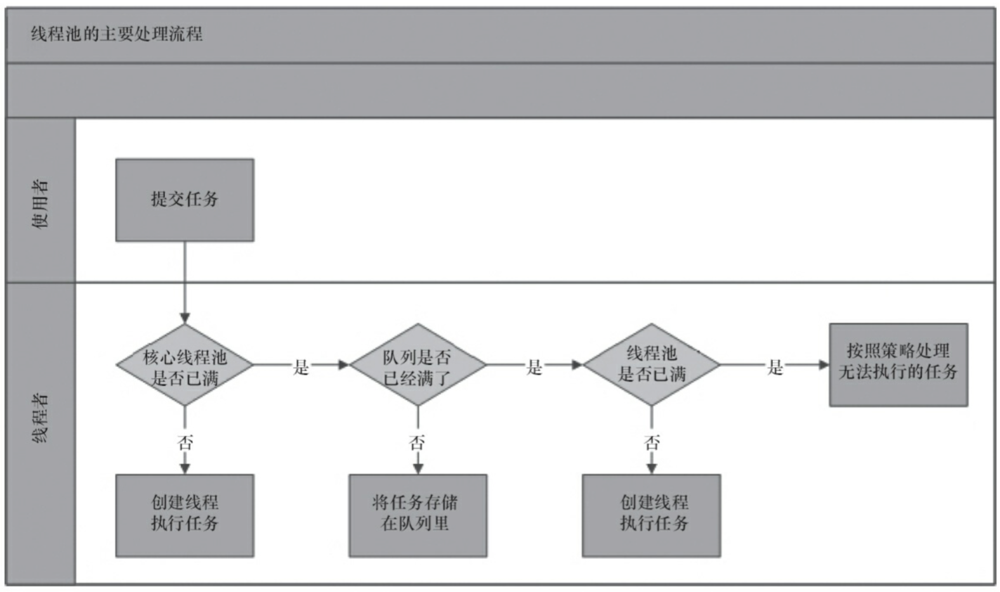
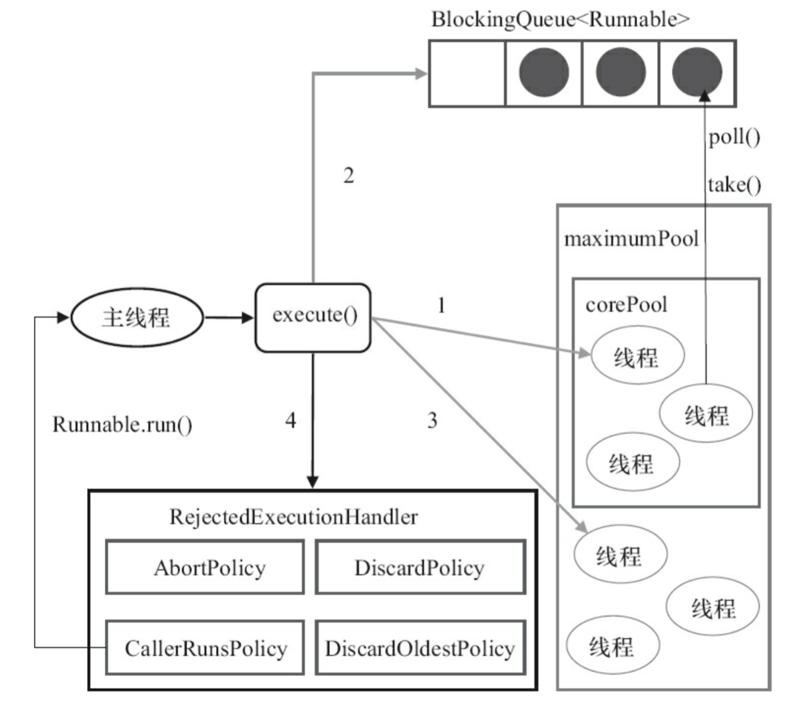
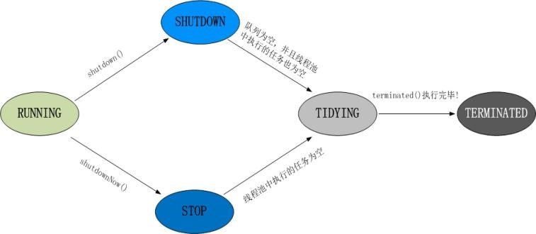

# 线程池
* 本质上是一种对象池，用于管理线程资源。
* 在任务执行前，需要从线程池中拿出线程来执行。
* 在任务执行完成之后，需要把线程放回线程池。
* 通过线程的这种反复利用机制，可以有效地避免直接创建线程所带来的坏处。
* （来源：https://www.jianshu.com/p/7ab4ae9443b9）

# 线程池实现原理

上图是线程池的主要处理流程。关注点在于，任务提交之后是怎么执行的。大致如下：

1. 判断核心线程池是否已满，如果不是，则创建线程执行任务
2. 如果核心线程池满了，判断队列是否满了，如果队列没满，将任务放在队列中
3. 如果队列满了，则判断线程池是否已满，如果没满，创建线程执行任务
4. 如果线程池也满了，则按照拒绝策略对任务进行处理

在jdk里面，可以将处理流程描述得更清楚一点。下图为ThreadPoolExecutor的处理流程。

概念映射：
* `corePool` -> 核心线程池
* `maximumPool` -> 线程池
* `BlockQueue` -> 队列
* `RejectedExecutionHandler` -> 拒绝策略

# 创建线程池
Executors是一个线程池工厂，提供了很多的工厂方法
```java
public class Executors { 
    /** 创建单一线程的线程池 */
    public static ExecutorService newSingleThreadExecutor();
    /** 创建固定数量的线程池 */
    public static ExecutorService newFixedThreadPool(int nThreads);
    /** 创建带缓存的线程池 */
    public static ExecutorService newCachedThreadPool();
    /** 创建定时调度的线程池 */
    public static ScheduledExecutorService newScheduledThreadPool(int corePoolSize);
    /** 创建流式（fork-join）线程池 */
    public static ExecutorService newWorkStealingPool();
}
```
1. `创建单一线程的线程池`
    * 顾名思义，这个线程池只有一个线程。若多个任务被提交到此线程池，那么会被缓存到队列（队列长度为`Integer.MAX_VALUE`）。
    当线程空闲的时候，按照FIFO的方式进行处理
2. `创建固定数量的线程池`
    * 和`创建单一线程的线程池`类似，只是这儿可以并行处理任务的线程数更多一些罢了。若多个任务被提交到此线程池，会有下面的处理过程。
      1. 如果线程的数量未达到指定数量，则创建线程来执行任务
      2. 如果线程池的数量达到了指定数量，并且有线程是空闲的，则取出空闲线程执行任务
      3. 如果没有线程是空闲的，则将任务缓存到队列（队列长度为`Integer.MAX_VALUE`）。当线程空闲的时候，按照FIFO的方式进行处理
3. `创建带缓存的线程池`
    * 这种方式创建的线程池，核心线程池的长度为0，线程池最大长度为`Integer.MAX_VALUE`。
    由于本身使用`SynchronousQueue`作为等待队列的缘故，导致往队列里面每插入一个元素，必须等待另一个线程从这个队列删除一个元素。
4. `创建定时调度的线程池`
    * 和上面3个工厂方法返回的线程池类型有所不同，它返回的是ScheduledThreadPoolExecutor类型的线程池。
    平时实现定时调度功能的时候，可能更多的是使用第三方类库，比如：quartz等。但是对于更底层的功能，仍然需要了解。
    ```java
    public class ThreadPoolTest {
        public static void main(String[] args) {
            ScheduledExecutorService executor = Executors.newScheduledThreadPool(2);
    
            // 定时调度，每个调度任务会至少等待`period`的时间，
            // 如果任务执行的时间超过`period`，则等待的时间为任务执行的时间
            executor.scheduleAtFixedRate(() -> {
                try {
                    Thread.sleep(10000);
                    System.out.println(System.currentTimeMillis() / 1000);
                } catch (InterruptedException e) {
                    e.printStackTrace();
                }
            }, 0, 2, TimeUnit.SECONDS);
    
            // 定时调度，第二个任务执行的时间 = 第一个任务执行时间 + `delay`
            executor.scheduleWithFixedDelay(() -> {
                try {
                    Thread.sleep(5000);
                    System.out.println(System.currentTimeMillis() / 1000);
                } catch (InterruptedException e) {
                    e.printStackTrace();
                }
            }, 0, 2, TimeUnit.SECONDS);
    
            // 定时调度，延迟`delay`后执行，且只执行一次
            executor.schedule(() -> System.out.println("5 秒之后执行 schedule"), 5, TimeUnit.SECONDS);
        }
    }
    ```
    1. `scheduleAtFixedRate(Runnable command, long initialDelay, long period, TimeUnit unit)`，定时调度，
    每个调度任务会至少等待period的时间，如果任务执行的时间超过`period`，则等待的时间为任务执行的时间
    2. `scheduleWithFixedDelay(Runnable command, long initialDelay, long delay, TimeUnit unit)`，
    定时调度，第二个任务执行的时间 = 第一个任务执行时间 + `delay`
    3. `schedule(Runnable command, long delay, TimeUnit unit)`，定时调度，延迟`delay`后执行，且只执行一次
5. 手动创建线程池
    * 理论上，我们可以通过Executors来创建线程池，这种方式非常简单。但正是因为简单，所以限制了线程池的功能。
    比如：无长度限制的队列，可能因为任务堆积导致OOM，这是非常严重的bug，应尽可能地避免。
    怎么避免？归根结底，还是需要通过更底层的方式来创建线程池。
    * 抛开定时调度的线程池不管，来看ThreadPoolExecutor。它提供了好几个构造方法，
    但是最底层的构造方法却只有一个。那么，我们就从这个构造方法着手分析。
    ```java
    public class ThreadPoolExecutor extends AbstractExecutorService {
       public ThreadPoolExecutor(int corePoolSize,
                                 int maximumPoolSize,
                                 long keepAliveTime,
                                 TimeUnit unit,
                                 BlockingQueue<Runnable> workQueue,
                                 ThreadFactory threadFactory,
                                 RejectedExecutionHandler handler);
    }
    ```
    参数分析：
    * `rePoolSize`，线程池中的核心线程数
    * `maximumPoolSize`，线程池中的最大线程数
    * `keepAliveTime`，空闲时间，当线程池数量超过核心线程数时，多余的空闲线程存活的时间，即：这些线程多久被销毁。
    * `unit`，空闲时间的单位，可以是毫秒、秒、分钟、小时和天，等等
    * `workQueue`，等待队列，线程池中的线程数超过核心线程数时，任务将放在等待队列，它是一个BlockingQueue类型的对象
        * 等待队列是BlockingQueue类型的，理论上只要是它的子类，我们都可以用来作为等待队列。
        1. `ArrayBlockingQueue`，队列是有界的，基于数组实现的阻塞队列
        2. `LinkedBlockingQueue`，队列可以有界，也可以无界。基于链表实现的阻塞队列
        3. `SynchronousQueue`，不存储元素的阻塞队列，每个插入操作必须等到另一个线程调用移除操作，
        否则插入操作将一直处于阻塞状态。该队列也是Executors.newCachedThreadPool()的默认队列
        4. `PriorityBlockingQueue`，带优先级的无界阻塞队列
    * `threadFactory`，线程工厂，我们可以使用它来创建一个线程，也可以自定义线程名称
        * `Executors`的实现使用了默认的线程工厂-`DefaultThreadFactory`。它的实现主要用于创建一个线程，
        线程的名字为`pool-{poolNum}-thread-{threadNum}`
    * `handler`，拒绝策略，当线程池和等待队列都满了之后，需要通过该对象的回调函数进行回调处理
        1. `CallerRunsPolicy` 在调用者线程执行
        2. `AbortPolicy` 直接抛出RejectedExecutionException异常
        3. `DiscardPolicy` 任务直接丢弃，不做任何处理
        4. `DiscardOldestPolicy` 丢弃队列里最旧的那个任务，再尝试执行当前任务
        * 这四种策略各有优劣，比较常用的是DiscardPolicy，但是这种策略有一个弊端就是任务执行的轨迹不会被记录下来。
        所以，往往需要实现自定义的拒绝策略， 通过实现RejectedExecutionHandler接口的方式。

# 提交任务的两种方式
1. `execute()` 用于提交不需要返回结果的任务
2. `submit()` 用于提交一个需要返回果的任务。
该方法返回一个Future对象，通过调用这个对象的get()方法，就能获得返回结果果。get()方法会一直阻塞，直到返回结果返回。
另外，我们也可以使用它的重载方法get(long timeout, TimeUnit unit)，这个方法也会阻塞，但是在超时时间内仍然没有返回结果时，
将抛出异常TimeoutException。

# 关闭线程池
1. `shutdown()` 会将线程池状态置为`SHUTDOWN`，不再接受新的任务，同时会等待线程池中已有的任务执行完成再结束。
2. `shutdownNow()` 会将线程池状态置为`SHUTDOWN`，对所有线程执行`interrupt()`操作，清空队列，并将队列中的任务返回回来。
* 另外，关闭线程池涉及到两个返回boolean的方法，`isShutdown()`和`isTerminated()`，分别表示是否关闭和是否终止

# 线程池监控
如果系统中大量用到了线程池，那么有必要对线程池进行监控。利用监控，能在问题出现前提前感知到，
也可以根据监控信息来定位可能出现的问题。
* ThreadPoolExecutor自带方法：
    1. `long getTaskCount()`，获取已经执行或正在执行的任务数
    2. `long getCompletedTaskCount()`，获取已经执行的任务数
    3. `int getLargestPoolSize()`，获取线程池曾经创建过的最大线程数，根据这个参数，可以知道线程池是否满过
    4. `int getPoolSize()`，获取线程池线程数
    5. `int getActiveCount()`，获取活跃线程数（正在执行任务的线程数）
* ThreadPoolExecutor自带回调方法：
    1. `protected void beforeExecute(Thread t, Runnable r)` 任务执行前被调用
    2. `protected void afterExecute(Runnable r, Throwable t)` 任务执行后被调用
    3. `protected void terminated()` 线程池结束后被调用

# 线程池状态

```java
public class ThreadPoolExecutor extends AbstractExecutorService {
    // runState is stored in the high-order bits
    private static final int RUNNING    = -1 << COUNT_BITS;
    private static final int SHUTDOWN   =  0 << COUNT_BITS;
    private static final int STOP       =  1 << COUNT_BITS;
    private static final int TIDYING    =  2 << COUNT_BITS;
    private static final int TERMINATED =  3 << COUNT_BITS;
}
```
* `RUNNING`
    1. `状态说明`：自然是运行状态，指可以接受任务执行队列里的任务线程池的初始化状态是`RUNNING`。换句话说，
    线程池被一旦被创建，就处于`RUNNING`状态，并且线程池中的任务数为0
    2. `状态切换`：线程池的初始化状态是`RUNNING`。换句话说，线程池被一旦被创建，就处于`RUNNING`状态，并且线程池中的任务数为0
    ```text
    private final AtomicInteger ctl = new AtomicInteger(ctlOf(RUNNING, 0));
    ```
* `SHUTDOWN` 
    1. `状态说明`：线程池处在`SHUTDOWN`状态时，不接收新任务，但能处理已添加的任务
    2. `状态切换`：调用线程池的`shutdown()`接口时，线程池由`RUNNING -> SHUTDOWN`
* `STOP`
    1. `状态说明`：线程池处在`STOP`状态时，不接收新任务，不处理已添加的任务，并且会中断正在处理的任务
    2. `状态切换`：调用线程池的`shutdownNow()`接口时，线程池由`(RUNNING or SHUTDOWN ) -> STOP`
* `TIDYING`
    1. `状态说明`：当所有的任务已终止，任务数量为0，线程池会变为`TIDYING`状态。当线程池变为`TIDYING`状态时，
    会执行钩子函数`terminated()`。`terminated()`在`ThreadPoolExecutor`类中是空的，若用户想在线程池变为`TIDYING`时，
    进行相应的处理；可以通过重载`terminated()`函数来实现。 
    2. `状态切换`：当线程池在`SHUTDOWN`状态下，阻塞队列为空并且线程池中执行的任务也为空时，就会由 `SHUTDOWN -> TIDYING`。
    当线程池在STOP状态下，线程池中执行的任务为空时，就会由`STOP -> TIDYING`
* `TERMINATED`
    1. `状态说明`：线程池彻底终止，就变成`TERMINATED`状态
    2. `状态切换`：线程池处在`TIDYING`状态时，执行完`terminated()`之后，就会由 `TIDYING -> TERMINATED`

# 如何配置线程池参数
通常我们是需要根据这批任务执行的性质来确定的
* `IO 密集型任务`：由于线程并不是一直在运行，所以可以尽可能的多配置线程，比如 CPU 个数 * 2
* `CPU 密集型任务`（大量复杂的运算）：应当分配较少的线程，比如 CPU 个数相当的大小
