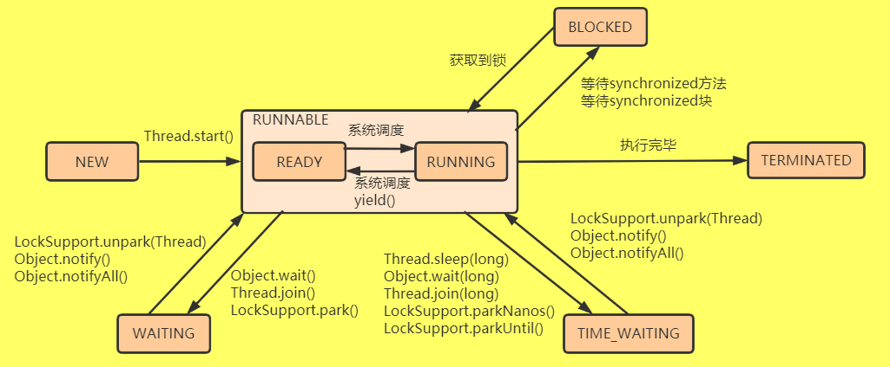

# 线程的5种基本状态

Java 线程在运行的生命周期中的指定时刻只可能处于下面 6 种不同状态的其中一个状态（参考《Java 并发编程艺术》4.1.4 节）。
* `初始状态（NEW）`
   * 初始状态，线程被构建，但是还没有调用`start()`方法
* `运行状态（RUNNABLE）`
   * 运行状态，Java线程将操作系统中的就绪`READY`和运行`RUNNING`两种状态笼统的称作"运行中"
* `阻塞状态（BLOCKED）`
  * 阻塞状态，表示线程阻塞于锁(`monitor lock`)
* `等待状态（WAITING）`
   * 等待状态，表示线程进入等待状态，进入该状态表示当前线程需要`无限期`等待其他线程执行特定操作（通知或中断）
* `超时等待状态（TIME_WAITING）`
    * 超时等待状态，指定了等待超时时间的`WAITING`状态，达到指定等待超时时间自行返回
* `终止状态（TERMINATED）`
    * 终止状态，表示当前线程已经执行完毕
